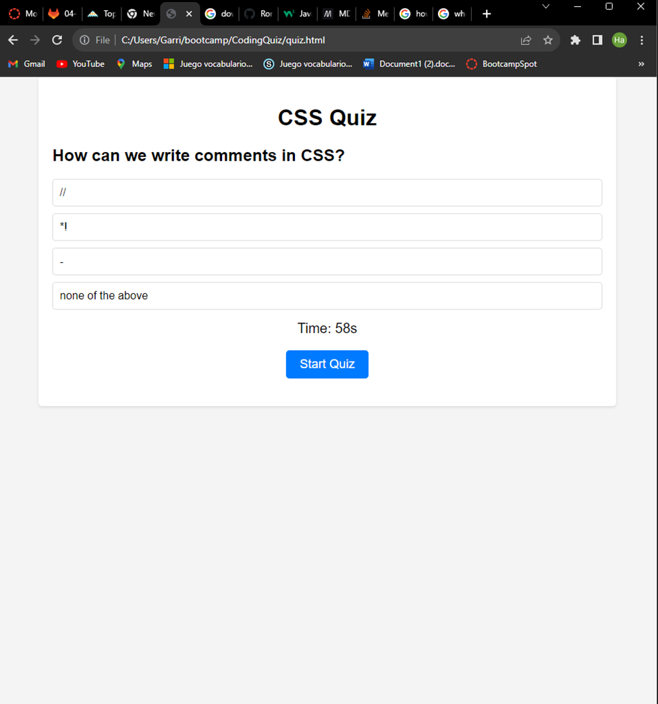

# CodingQuiz
This is a quiz to test knowledge on the coding language "CSS". My motivation to create this CSS quiz is to test/refresh developers or aspiring developers knoledge.

## User Story
AS A coding boot camp student
I WANT to take a timed quiz on JavaScript fundamentals that stores high scores
SO THAT I can gauge my progress compared to my peers

## Resources
https://www.interviewbit.com/css-mcq/#how-can-we-write-comments-in-css - This website was used to provide some questions for quiz and google for the rest.
https://www.w3schools.com/
https://stackoverflow.com/
https://developer.mozilla.org/en-US/
All links provided were used to assist me with this quiz.

## Picture 

## Deployed application link
https://ronithenewcoder.github.io/CodingQuiz/